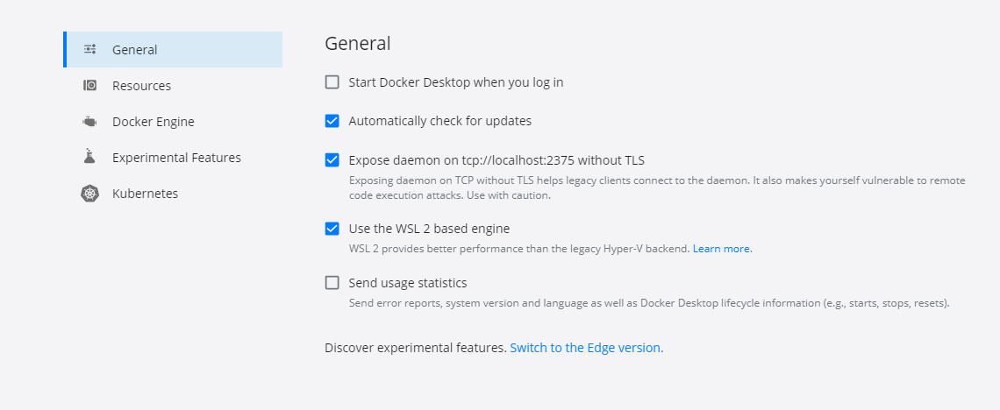

# Задача Интеграционное тестирование

Теперь, когда мы умеем создавать образы и знаем, что можно их тестировать из Java кода, можно протестировать [приложение из первого задания этого модуля](../../spring_boot/task1/README.md).

## Описание

0. Если ваш компьютер использует операционную систему Windows, тогда в проверьте, что в `Docker desktop` в настройках во вкладке General стоит галочка напротив пунктва `Expose daemon on...`, как на картинке ниже. 


1. Первым делом нам надо собрать jar архивы с нашими spring boot приложениями. Для этого в терминале в корне нашего проект выполните команду:
                                                                               
Для gradle: `./gradlew clean build` (если пишет Permission denied тогда сначала выполните `chmod +x ./gradlew`)
                                                                               
Для maven: `./mvnw clean package` (если пишет Permission denied тогда сначала выполните `chmod +x ./mvnw`)

2. Теперь мы соберем два образа для разных окружений - dev и prod. Для этого:
 - для первого установите порт `server.port=8080` и профиль в dev с помощью параметра `netology.profile.dev=true` в application.properties и соберите приложение:
   - Для gradle: `./gradlew clean build` (если пишет Permission denied тогда сначала выполните `chmod +x ./gradlew`)
    
   - Для maven: `./mvnw clean package` (если пишет Permission denied тогда сначала выполните `chmod +x ./mvnw`)
 - добавьте Dockerfile в корень проекта:
```
FROM openjdk:8-jdk-alpine
EXPOSE 8080
ADD build/libs/<название вашего архива>.jar myapp.jar
ENTRYPOINT ["java","-jar","/myapp.jar"]
```
Если вы собирали с помощью maven, тогда jar будет лежать в папке `target`, а если gradle - в `build/libs`, и, соответственно, в `ADD` надо прописывать путь изходя из того, какой сборщик вы использовали.
 - теперь соберите образ выполнив в корне проекта в терминале команду `docker build -t devApp .`. Так мы соберем наше приложение в образ с названием `devApp`.
 
3. И теперь нам надо собрать второй образ из этого же приложения, но с другими параметрами.
 - установите порт `server.port=8081` и профиль в prod с помощью параметра `netology.profile.dev=false` в application.properties и соберите приложение как в предыдущем пунтке. 
 - измените в Dockerfile параметр `EXPOSE` с 8080 на 8081.
 - соберите образ выполнив в корне проекта в терминале команду `docker build -t prodApp .`. Так мы соберем наше приложение в образ с названием `prodApp`.
 
4. Напишем наш интеграционный тест:
 - добавьте в зависимость проекта 
   - для gradle - 
```testImplementation 'org.testcontainers:junit-jupiter```
   - для maven - 
```
<dependency>
    <groupId>org.testcontainers</groupId>
    <artifactId>junit-jupiter</artifactId>
    <scope>test</scope>
</dependency>
```
 - напишите тестовый класс в директории `src/test`:
```java
@SpringBootTest(webEnvironment = SpringBootTest.WebEnvironment.RANDOM_PORT)
class DemoApplicationTests {
    @Autowired
    TestRestTemplate restTemplate;

    @BeforeAll
    public static void setUp() {
     
    }

    @Test
    void contextLoads() {
        ResponseEntity<String> forEntity = restTemplate.getForEntity("http://localhost:" + myapp.getMappedPort(8080), String.class);
        System.out.println(forEntity.getBody());
    }

}
```

 - здесь вам надо создать два своих `GenericContainer` в полях класса - каждый под свой образ, который мы создали ранее. 
 - в методе `setUp()` стартуйте контейнеры своих образов.
 - напишите два юнит тесты для проверки корректности того, что вернет вам ваше приложение. Для этого используйте объект класса `TestRestTemplate`, который представлен в примере. С помощью него сделайте запрос. Для того, чтобы понять на каком порту запущен ваш контейнер, воспользуйтесь методом `getMappedPort`, как на примере из лекции. И для проверки корректности ответа проверьте с помощью метода `assertEquals`.
 

 
 


